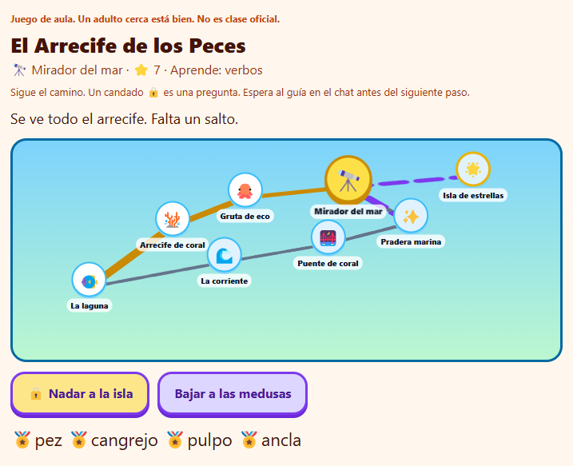
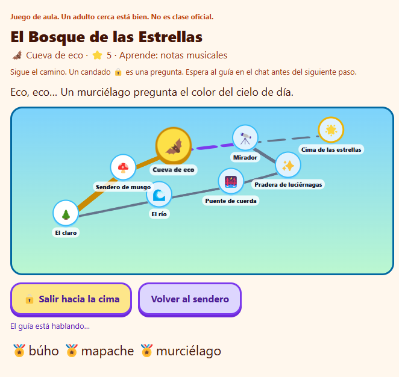

<div align="center">

# Urano Kidquest

[](https://github.com/uranotools/UranoDesktop)
[](https://github.com/uranotools/UranoDesktop)
[](#1-qué-es)
[](./LICENSE)

**Aventura por turnos: el niño recorre un mapa, responde trivias y colecciona medallas. El adulto elige qué aprender y en qué mundo jugar.**

*Juego de aula / casa. Un adulto cerca está bien. No es niñera ni material escolar certificado.*

</div>

---

## 1. Qué es

Kidquest es un plugin de **Urano Desktop**: una **ventana de mapa** (MultiverseTab) y **tarjetas grandes** en el chat. El niño casi no lee párrafos; pulsa caminos, espera al guía y responde preguntas de tres opciones.

La dinámica no cambia: **sitio → candado → pregunta → medalla → siguiente sitio**. Lo que cambia cada partida es el **mundo** (bosque, carros, peces, espacio) y el **tema** que el adulto quiere practicar (sumas, colores, letras, animales…).

| Dónde | Qué ve el niño |
|--------|----------------|
| **Tab** `QUEST:aventura` | Mapa con camino, escena, estrellas, medallas y botones |
| **Chat** | Una línea corta + tarjeta (`CheerCard`, `QuizCard`, `RecapCard`) |

El agente **no pide archivos**. El grafo vive en `fixtures/`. Las preguntas salen del tema de esa partida (la IA las arma nuevas; si falla, hay un banco local).

---

## 2. Cómo se juega

```text
Adulto elige tema + mundo
        ↓
El niño pulsa un camino en el mapa
        ↓
La tab espera (animación) hasta que el guía muestra la tarjeta
        ↓
Si hay 🔒, responde la trivia en el chat
        ↓
Avanza, gana una medalla, elige el siguiente paso
        ↓
Al llegar a la meta: “Hoy aprendió” para el adulto
```

1. El adulto dice, por ejemplo: *«Que practique sumas, en el mundo de carros.»*  
   O elige el mundo en la tab y escribe el tema en el chat.
2. El niño sigue el **camino dibujado**. El círculo amarillo es “estás aquí”.
3. Un **candado** es una pregunta. Tres botones; si acierta, el sendero se abre.
4. Mientras el guía habla, los botones se **bloquean** (el mapa late y dice “El guía te está hablando…”). Cuando aparece la tarjeta, puede elegir otra vez. Si se traba, a los ~8 s el adulto puede pulsar **Ya leí el chat**.
5. En la cima (o con `/estrellas`) sale un recuento: tema, mundo, aciertos y cada pregunta.

Comandos en el chat: `/mapa` · `/estrellas`.

---

## 3. Mundos y temas

Misma topología (8 sitios). Cambia el disfraz y las medallas.

| Mundo | Dile al guía | Ambiente |
|--------|----------------|----------|
| 🌲 Bosque | bosque, estrellas | Claro, río, cueva, cima |
| 🚗 Carros | carros, autos | Garage, taller, meta |
| 🐠 Peces | peces, mar | Laguna, arrecife, isla |
| 🚀 Espacio | espacio, planetas | Estación, cometa, estrella |

**Temas** (ejemplos; el adulto puede pedir otro):

- sumas / restas / contar  
- colores  
- letras y vocales  
- animales  

Hay **8 preguntas** por partida. No es el mismo cuestionario siempre.

Misma ruta de ocho sitios; cambia el disfraz y lo que se practica:

<table>
<tr>
<td width="50%" valign="top">

<p align="center"><strong>Peces</strong> · tema <em>verbos</em><br/>Laguna → coral → isla. El candado abre el último salto.</p>
</td>
<td width="50%" valign="top">

<p align="center"><strong>Bosque</strong> · tema <em>notas musicales</em><br/>Claro → cueva. El guía habla; el mapa espera.</p>
</td>
</tr>
</table>

---

## 4. Para quién es (y para quién no)

**Sí:** un adulto y un niño de 6–10, en casa o en el aula, con 10–20 minutos.

**No es:**

- Niñera, babysitter ni “déjalo solo con la IA”.
- Material escolar certificado, rúbrica oficial ni app de deberes.
- Un mundo abierto infinito: los sitios no se inventan; solo el JSON + el disfraz del mundo.
- Voz, red social ni juego en la nube.

Los casos y preguntas son **sintéticos de juego**. El recuento final describe *lo que se preguntó en esa partida*, no un diagnóstico de aprendizaje.

---

## 5. Instalación

**Modo desarrollador**

MCP Manager → Desarrollador → Vincular carpeta → `urano-kidquest/`.

**ZIP**

```bash
npm install
npm run pack
```

Instala `urano-kidquest.zip` en Integraciones de Urano Desktop. Autoriza el módulo en el agente. Al abrir el chat, el Engine deja el **lobby** (elegir mundo). Luego el adulto dice el tema.

El ZIP lleva `ui/widgets.js`, `SKILL.md` y **todo** `fixtures/`.

### Ajustes

| Ajuste | Para qué |
|--------|----------|
| `DATA_DIR` (opcional) | Carpeta propia con `quests/*.json`. Si está vacío, se usan los fixtures del plugin. |

---

## 6. Qué hay en el chat y en la tab

| Pieza | Rol |
|--------|-----|
| `QuestBoard` | Tablero: mapa, camino, botones, espera animada |
| `CheerCard` | “Llegaste a este sitio” — desbloquea el mapa |
| `QuizCard` | Trivia de 3 opciones |
| `StampCard` | Medallas / estrellas |
| `RecapCard` | Al final: lo que el niño practicó, para el adulto |

Protocolo del guía (resumen): una línea de texto + `urano_render_json`. No volcar el grafo. `start_quest({ tema, mundo })` → `fill_quizzes` → tarjeta. Al meta, `RecapCard`.

---

## 7. Build

```bash
npm install          # deps de empaquetado
npm run deploy       # UI + plugins → dist/
npm run urano-launch # urano-kidquest.zip
npm run pack         # deploy + zip
```

Node ≥ 18. El plugin no tiene dependencias de runtime propias: React llega por JsonLive de Desktop.

---

## 8. Repo (para quien empaqueta)

```text
urano-kidquest/
  README.md
  assets/                  ← capturas (peces + verbos, bosque + notas)
  SKILL.md                 ← instrucciones del guía
  fixtures/quests/         ← grafo (bosque-estrellas.json)
  Plugins/Quest/           ← motor, mundos, banco de quizzes
  Plugins/Engine/          ← lobby al abrir la sesión
  ui/src/                  ← widgets del mapa y las tarjetas
```

Caminos y coordenadas salen del JSON. Los mundos (carros, peces, espacio) son **pieles** sobre esa misma aventura. Las preguntas nuevas las rellena `fill_quizzes`; si no, el banco local.

---

## Licencia

MIT. Juego de aula / casa. Un adulto cerca está bien.
